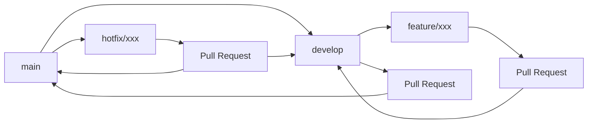

# Git 分支策略

> 本文档介绍项目采用的 Git 分支管理策略，包括分支类型、保护机制和生命周期管理。

## 1. 分支策略概览

### 1.1 为什么需要分支策略？

**核心问题**：在多人协作开发中，如何确保代码质量、避免冲突、支持并行开发？

**传统问题**：

- ⚠️ **直接在主分支开发**：多人同时修改导致冲突频繁
- ⚠️ **代码质量无法保证**：没有审查机制，bug 直接进入生产环境
- ⚠️ **版本管理混乱**：无法区分开发版本和生产版本
- ⚠️ **回滚困难**：问题代码难以快速回滚

**Git Flow 解决方案**：

- ✅ **隔离开发环境**：通过分支隔离不同阶段的代码
- ✅ **强制代码审查**：通过 PR 机制确保代码质量
- ✅ **版本控制**：明确区分开发、测试、生产环境
- ✅ **快速回滚**：保持主分支稳定，支持快速回滚

### 1.2 分支类型与职责

本项目采用 **Git Flow**（Git 工作流）分支模型，每个分支都有明确的职责和生命周期：

| 分支类型     | 分支名称    | 核心职责               | 保护级别    | 技术原理                       |
| ------------ | ----------- | ---------------------- | ----------- | ------------------------------ |
| **主分支**   | `main`      | 生产环境代码，稳定版本 | 🔒 完全保护 | 始终保持可部署状态，零容忍 bug |
| **开发分支** | `develop`   | 集成开发，功能合并     | 🔒 完全保护 | 功能集成的沙盒环境，允许不稳定 |
| **功能分支** | `feature/*` | 新功能开发             | ⚠️ 临时分支 | 隔离开发，避免影响其他功能     |
| **修复分支** | `hotfix/*`  | 紧急修复               | ⚠️ 临时分支 | 绕过正常流程，快速修复生产问题 |
| **发布分支** | `release/*` | 版本发布准备           | ⚠️ 临时分支 | 版本冻结，专注测试和修复       |

### 1.3 分支生命周期



## 2. 分支保护策略

### 2.1 为什么需要分支保护？

**核心问题**：如何防止人为错误和恶意操作破坏代码库的稳定性？

**常见风险**：

- ⚠️ **误操作**：开发者意外直接推送到主分支
- ⚠️ **恶意操作**：内部人员故意破坏代码
- ⚠️ **权限滥用**：管理员绕过正常流程
- ⚠️ **历史重写**：强制推送破坏 Git 历史
- ⚠️ **分支删除**：重要分支被意外删除

**保护机制原理**：

- 🛡️ **访问控制**：限制谁可以做什么操作
- 🔍 **质量门禁**：确保代码质量达到标准
- 📋 **流程强制**：强制执行代码审查流程
- 🔒 **历史保护**：防止 Git 历史被破坏

### 2.2 Main 分支保护策略

**设计目标**：确保主分支始终保持生产就绪状态，零容忍 bug 和低质量代码。

**保护机制**：

| 保护规则             | 技术原理            | 解决的问题           | 预期效果                        |
| -------------------- | ------------------- | -------------------- | ------------------------------- |
| **禁止直接推送**     | 强制通过 PR 流程    | 防止绕过代码审查     | 确保所有代码都经过审查          |
| **必须通过 PR 合并** | GitHub Webhook 机制 | 强制执行审查流程     | 提高代码质量和团队协作          |
| **需要代码审查**     | 人工 + 自动化检查   | 防止单人决策错误     | 多角度验证代码正确性            |
| **状态检查通过**     | CI/CD 集成检查      | 防止有问题的代码合并 | 自动化质量保证                  |
| **禁止强制推送**     | Git 历史保护        | 防止历史被重写       | 保持 Git 历史的完整性和可追溯性 |
| **禁止删除分支**     | 分支生命周期管理    | 防止重要分支丢失     | 保护项目结构和历史记录          |

**状态检查要求**：

```yaml
required_status_checks:
  - ruff (代码检查) # 确保代码风格和潜在问题
  - mypy (类型检查) # 确保类型安全和接口一致性
  - pytest (单元测试) # 确保功能正确性和回归保护
  - pre-commit (提交钩子) # 确保提交前的质量检查
```

### 2.3 Develop 分支保护策略

**设计目标**：在保持开发效率的同时，确保代码质量，为生产环境做好准备。

**与 Main 分支的区别**：

- 🎯 **更宽松的测试要求**：允许部分测试失败，专注于核心功能
- ⚡ **更快的合并速度**：减少不必要的检查，提高开发效率
- 🔄 **更频繁的集成**：支持持续集成和快速迭代

**保护机制**：

| 保护规则             | 技术原理            | 解决的问题       | 预期效果           |
| -------------------- | ------------------- | ---------------- | ------------------ |
| **禁止直接推送**     | 强制通过 PR 流程    | 防止绕过代码审查 | 确保代码质量       |
| **必须通过 PR 合并** | GitHub Webhook 机制 | 强制执行审查流程 | 团队协作和知识共享 |
| **需要代码审查**     | 人工检查机制        | 防止明显错误     | 早期发现问题       |
| **基础状态检查**     | 核心质量检查        | 防止严重问题     | 保持基本代码质量   |
| **禁止强制推送**     | Git 历史保护        | 防止历史被重写   | 保持开发历史完整性 |

**状态检查要求**：

```yaml
required_status_checks:
  - ruff (代码检查) # 核心代码质量检查
  - mypy (类型检查) # 类型安全基础检查
  - pre-commit (提交钩子) # 提交前基础检查
```

---

> **一句话总结**：本项目采用 Git Flow 分支模型，通过严格的分支保护机制，确保代码质量和团队协作的高效性。详细的工作流程请参考 [工作流程指南](./002-workflow-guide.md)。
